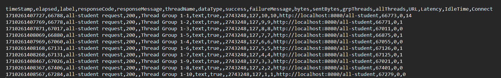
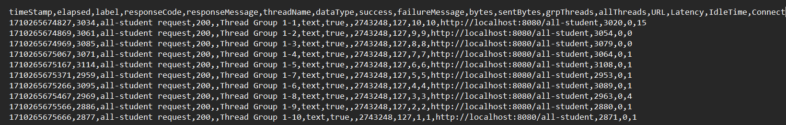
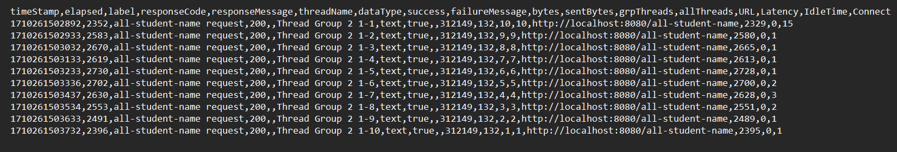
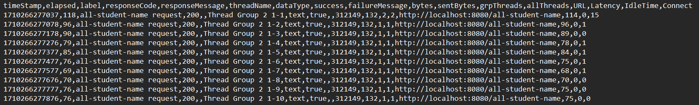
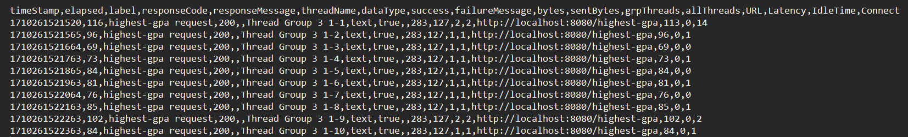
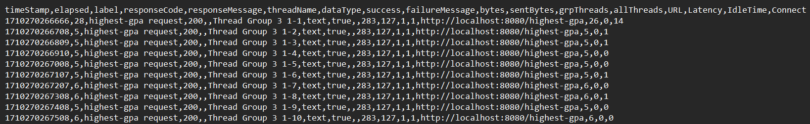

# Refleksi Tutorial Pemrograman Lanjut

Tutorial 5

## Performance Testing with JMeter and Profiling with IntelliJ Profiler

### Scope
JMeter lebih fokus dalam melakukan pengujian _behavior_ dan _load_ pengguna. Sementara itu, IntelliJ Profiler lebih 
fokus dalam menganalisis kode internal, identifikasi _performance bottlenecks_, dan optimasi bagian kode yang spesifik.

### Testing Stage
JMeter biasanya digunakan ketika melakukan _testing_ oleh QA, yaitu ketika QA ingin mengetahui performa aplikasi secara
umum di berbagai kondisi. Sementara itu, IntelliJ Profiler lebih sering digunakan dalam proses _development_ untuk 
melakukan optimasi terhadap bagian-bagian spesifik suatu kode.

### Output
JMeter menyediakan matriks tertentu yang berhubungan dengan _response times_, _throughput_, dan _concurrency_.
Sementara itu, IntelliJ Profiler menyediakan rincian mengenai performa suatu kode sampai ke level _method_, _memory
usage_, dan _code execution_.

## Identifying and Understanding the Weak Points in the Application
_Profiling_ merupakan suatu tahapan yang penting dalam mengidentifikasi dan memahami titik lemah dalam aplikasi dengan 
menyediakan rincian terhadap _runtime behavior_, _resource usage_, dan _performance characteristics_. Dengan
menganalisis data yang didapat ketika _profiling_, _programmer_ akan mendapatkan pemahaman yang komprehensif tentang 
aplikasi mereka di berbagai aspek. Pemahaman ini akan membuat mereka dapat mengimplementasi optimisasi suatu bagian kode
yang telah diidentifikasi titik lemahnya.

## Effectivity of IntelliJ Profiler
IntelliJ Profiler merupakan salah satu _tool_ yang cukup efektif karena dibekali dengan banyaknya kelebihan yang dapat
membantu _programmer_, seperti terintegrasinya dengan IDE, tampilan antarmuka yang _user friendly_, adanya fitur
_real time data-analysis_, tersedia banyak pilihan _profiling_, adanya _memory analysis_, level _profiling_ sampai ke
ranah _method_, dan berbagai _advanced features_ lainnya (_flame graphs_, _call trees_, dan _hot spot analysis_).

## The Main Challenges when Conducting Performance Testing and Profiling
### Limited Knowledge on How Using Profiling Tool(s)
Pengguna mungkin memiliki pemahaman terbatas tentang cara menggunakan alat-alat _profiler_ sehingga perlu adanya 
dokumentasi yang cukup, serta adanya pelatihan untuk memahami konsep dasar alat yang digunakan.

### Test Scalability
Performa aplikasi di lingkungan _testing_ bisa saja tidak mencerminkan kondisi skala produksi yang sebenarnya sehingga
perlu dilakukan simulasi pengguna berskala besar dan pastikan hasilnya mencakup berbagai skenario penggunaan.

### The Complexity of Analyzed Data
Hasil _testing_ dan _profiling_ bisa saja menghasilkan data yang kompleks dan sulit diinterpretasi. Oleh karena itu,
perlu digunakan visualisasi data yang efektif dan menerapkan analisis data yang relevan untuk mengidentifikasi pola 
dan masalah.

## The Main Benefits from Using IntelliJ Profiler for Profiling
IntelliJ Profiler memang diperuntukkan bagi _programmer_ pada tahap _development_ dan memang _tool_ ini berfokus
terhadap performa dari setiap _method_ yang digunakan ketika aplikasi dijalankan. Dengan rincian performa pada setiap
_method_ yang ada sebenarnya sudah sangat membantu proses pengembangan aplikasi karena dengan melakukan spesifikasi
tersebut, _programmer_ jadi lebih fokus untuk melakukan optimasi secara spesifik. 

## Inconsistency Between IntelliJ Profiler and JMeter Result
Salah satu cara yang dapat diimplementasikan adalah dengan menggunakan alat atau _tool_ _testing_ selain IntelliJ
Profiler dan JMeter. Hal ini sebagai paramater lain terhadap performa aplikasi sehingga kita dapat mengetahui pengujian
mana yang hasilnya lebih mendekati ke _tool_ lain ini. Tentu saja perlu juga diulas kembali mengenai spesifikasi sampel
_testing_ yang digunakan ketika menggunakan baik IntelliJ Profiler maupun JMeter. 

## Optimizing Application
### /all-student Endpoint
#### Before Optimization (JMeter)

#### After Optimization (JMeter)

#### Before Optimization (IntelliJ Profiler)

#### After Optimization (IntelliJ Profiler)

Pada _endpoint_ `/all-student` yang menggunakan _method_ `getAllStudentsWithCourses` di `StudentService`, 
saya melakukan optimasi dengan _method_ `studentCourseRepository.findAll` karena dengan _method_ ini, 
kita sudah dapat mengambil seluruh `student` beserta `course`-nya sehingga hal ini akan menghemat waktu komputasi yang 
awalnya menggunakan _nested for loop_. 

### /all-student-name Endpoint
#### Before Optimization (JMeter)

#### After Optimization (JMeter)

#### Before Optimization (IntelliJ Profiler)

#### After Optimization (IntelliJ Profiler)

Pada _endpoint_ `/all-student-name` yang menggunakan _method_ `joinStudentNames` di `StudentService`, 
saya melakukan optimasi dengan menggunakan `StringBuilder` karena kelas tersebut lebih efisien untuk membuat suatu 
rangkaian _string_ di dalam _loop_ yang bisa saja ukuran dari konkatenasinya cukup besar dibandingkan hanya dengan 
melakukan konkatenasi secara manual. Dengan menggunakan `StringBuilder`, kita juga dapat meminimalisir memori _overhead_
dan dapat meningkatkan performa secara keseluruhan.

### /highest-gpa Endpoint
#### Before Optimization (JMeter)

#### After Optimization (JMeter)

#### Before Optimization (IntelliJ Profiler)

#### After Optimization (IntelliJ Profiler)

Pada _endpoint_ `/highest-gpa` yang menggunakan _method_ `findStudentWithHighestGpa` di `StudentService`, saya melakukan
optimasi dengan menggunakan `studentRepository.findFirstByOrderByGpaDesc`. _Method_ ini sebenarnya _method_ _query_ yang
disediakan oleh Spring Data JPA yang didasarkan dari nama _method_-nya. _Method_ ini akan mengambil entitas `Student`
pertama yang sudah diurutkan berdasarkan poin `gpa` secara _descending_. Berikut merupakan rinciannya,

1. findFirst: Mengambil hasil pertama.
2. By: Mengindikasikan kriteria yang digunakan.
3. OrderByGpaDesc: Mengurutkan berdasarkan poin `gpa` secara _descending_.

